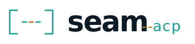

# seam-acp

<picture>
  <source media="(prefers-color-scheme: dark)" srcset="assets/seam-acp-logo-dark.svg">
  
</picture>

A bridge between chat platforms (Discord today, Slack tomorrow) and ACP-compatible coding agents (GitHub Copilot today, Claude Code / others tomorrow).

> **Status:** v0 — feature parity with the C# `copilot-discord-bot` complete. Multi-platform / multi-agent abstractions baked in from day one; only Discord + Copilot are implemented today.

## What it does

- Run a chat bot on a server / home lab / VM.
- From your phone (Discord), spin up a session per thread.
- Pick a repo with interactive buttons; chat with a coding agent in the thread.
- Switch model on the fly (interactive picker). Switch mode (Agent / Plan / Autopilot). Switch agent.

## Why ACP

The [Agent Client Protocol](https://agentclientprotocol.com) is the LSP-equivalent for coding agents. Picking ACP means:

- The agent integration is a typed protocol, not a vendor SDK.
- Switching to a different ACP-compatible agent is a config change, not a rewrite.
- We get streaming updates, mode switching, and live model switching as first-class features.

## Configure

Copy `.env.example` to `.env` and fill it in.

| Variable | Required | Notes |
|---|---|---|
| `DISCORD_BOT_TOKEN` | yes | From the Discord developer portal |
| `DISCORD_ALLOWED_USER_IDS` | yes | Comma-separated Discord user IDs that can control the bot (e.g. `123,456`) |
| `DISCORD_DEV_GUILD_ID` | no | Set to register slash commands instantly to one guild (good for dev) |
| `REPOS_ROOT` | yes | Root folder containing repos the agent can touch |
| `ATTACH_ROOTS` | no | Comma-separated extra absolute directories the `/seam attach` command (and the agent-side fence-to-file shortcut) can read from. `REPOS_ROOT` is always allowed. |
| `DATA_DIR` | no | Defaults to `./data` (sqlite lives here) |
| `DEFAULT_AGENT` | no | `copilot` or `gemini` |
| `DEFAULT_MODEL` | no | e.g. `gpt-5.4`, `claude-sonnet-4.5`, `claude-opus-4.7`, `auto` |
| `COPILOT_CLI_PATH` | no | If `copilot` is not on `PATH` |
| `COPILOT_PROFILES` | no | Register additional Copilot profiles, each with its own auth / config dir. Format: `id1:/abs/dir1,id2:/abs/dir2`. Each becomes an agent profile named `copilot-<id>` in `/seam agent`. Lets one bot serve multiple GitHub accounts; see "Multiple Copilot accounts" below. |
| `GEMINI_CLI_PATH` | no | If `gemini` is not on `PATH` |
| `GEMINI_DEFAULT_MODEL` | no | e.g. `gemini-2.5-pro` |
| `TURN_TIMEOUT_SECONDS` | no | Default 900 |
| `LOG_LEVEL` | no | `fatal` / `error` / `warn` / `info` / `debug` / `trace` |
| `HEALTH_PORT` | no | Default 3000 — exposes `GET /health` |
| `DEFAULT_PERMISSION_POLICY` | no | `ask` (recommended). Bot-wide default policy for new sessions. One of `always` (auto-approve), `ask` (prompt me on Discord), `deny` (auto-deny). Override per-session with `/seam approve`. |
| `DEFAULT_AUTO_APPROVE` | no | *Deprecated.* When `true`, forces the bot-wide default to `always`. Prefer `DEFAULT_PERMISSION_POLICY`. |

You also need the GitHub Copilot CLI installed locally (`brew install github/gh/copilot` or `npm i -g @github/copilot`) and authenticated (`copilot auth login`). The Docker image installs and runs the CLI for you, but you still need to mount auth state or sign in inside the container.

## Run (local dev)

```sh
npm install
cp .env.example .env   # then edit
npm run dev
```

The bot starts, registers `/seam` slash commands (guild-scoped if `DISCORD_DEV_GUILD_ID` is set, global otherwise — global takes up to an hour to propagate), and exposes `GET /health` on `HEALTH_PORT`.

## Run (Docker)

```sh
docker compose up -d --build
```

Pass `--build-arg INSTALL_COPILOT_CLI=false` if you want to mount your own Copilot CLI binary.

## Slash commands

All commands are restricted to users listed in `DISCORD_ALLOWED_USER_IDS` and (where it matters) thread-scoped.

| Command | What it does |
|---|---|
| `/seam new [name]` | Create a new public thread, bind a session to it, and post the repo picker — all in one step |
| `/seam init` | Bind the current thread as a session and post the repo picker |
| `/seam repo <path>` | Set the working repo (relative to `REPOS_ROOT` or absolute under it) |
| `/seam repos` | List repos found under `REPOS_ROOT` (hidden directories are skipped) |
| `/seam agent [id]` | With no id: posts an interactive picker of registered profiles. With id: switch directly. |
| `/seam model [id]` | With no id: starts the agent if needed and posts a picker of advertised models. With id: set directly (live if a runtime is active). |
| `/seam mode <id>` | Set the agent operational mode (e.g. plan / agent / autopilot) |
| `/seam effort <low\|medium\|high>` | Set reasoning effort (model-dependent) |
| `/seam tools <allow\|exclude> [csv]` | Tool allow / exclude list (empty list = clear) |
| `/seam approve <always\|ask\|deny>` | Permission policy for this thread. `always` auto-approves every request; `ask` posts a Discord prompt with buttons (auto-denies after 5 min); `deny` auto-denies. |
| `/seam abort` | Cancel the in-flight turn |
| `/seam config` | Show the session config JSON |
| `/seam config-set <json>` | Replace the session config wholesale |
| `/seam sessions` | List recent sessions across the bot |
| `/seam attach <path>` | Upload a host-side file (under `REPOS_ROOT` or `ATTACH_ROOTS`) into the channel without involving the agent |
| `/seam whoami` | Show which account this thread's agent profile is signed in as (Copilot only — reads `<config-dir>/config.json`) |
| `/seam avatar` | Re-push the bot avatar to Discord (force re-upload) |
| `/seam help` | Show this list |

Interactive pickers use buttons for ≤15 choices (laid out across up to 3 rows of 5) and a select menu for 16–25.

Free-form messages in a thread are sent straight to the agent. You can attach
files to a message and they'll be forwarded as ACP content blocks: images and
text-ish files (markdown, source code, JSON, CSV, logs, etc.) are inlined when
the agent supports it; everything else is sent as a CDN link the agent can
fetch. Limits per message: 8 attachments, 5 MB each, text inlined up to 256 KB.

If the agent emits an image, audio file, or embedded resource (in a tool
result or its own message stream), the bot uploads it to the thread as a
Discord attachment. Discord's free-tier 25 MB upload limit applies.

The bot also auto-uploads two adjacent cases:

- **Streaming fence-to-file.** Every fenced code block the agent emits is
  captured as it streams, stripped from chat, and uploaded as a Discord
  attachment named `snippet-N.<ext>` (extension inferred from the language
  tag; unknown tags fall back to `.txt`). This keeps long code out of the
  chat, makes the empty-pill / unclosed-fence runaway bug architecturally
  impossible, and gives consistent UX for any size snippet.
- **Fence-as-file shortcut.** If a fence's entire content is a single line
  that resolves to a real file under `REPOS_ROOT` or `ATTACH_ROOTS`, the
  bot uploads the *referenced file* instead of the snippet text. Symlinks
  are followed and the realpath is re-validated. Useful for "give me back
  that doc as an attachment" prompts.

### Multiple Copilot accounts

You can register more than one Copilot profile, each authenticated as a
different GitHub account, by setting `COPILOT_PROFILES`:

```sh
COPILOT_PROFILES=work:/Users/me/.copilot-work,personal:/Users/me/.copilot-personal
```

For each entry the bot spawns `copilot --acp --config-dir <dir>`. Copilot
keeps **all** of its state per `--config-dir` — auth tokens, MCP config,
session history — so the two profiles are fully isolated CLIs sharing
one binary. They show up in `/seam agent` as `copilot-work` and
`copilot-personal` alongside the default `copilot` profile.

One-time setup per account on the host (or inside the container):

```sh
COPILOT_HOME=/Users/me/.copilot-work copilot login
COPILOT_HOME=/Users/me/.copilot-personal copilot login
```

Verify in a thread with `/seam whoami` — the bot reads
`<config-dir>/config.json` and reports the GitHub login.

### MCP servers

The bot can attach Model Context Protocol servers globally to every
session. Configure them via env vars:

| Env var | Server | What it adds |
|---|---|---|
| `MCP_PLAYWRIGHT_ENABLED=true` | [`@playwright/mcp`](https://www.npmjs.com/package/@playwright/mcp) | Real Chromium browser. Lets the agent navigate sites and take screenshots; screenshots flow back as Discord attachments via the agent-file pipeline. Chromium (~150 MB) is downloaded by Playwright on first run. |

Add new servers in `src/mcp.ts`. Anything that emits `image` / `audio` /
embedded resource content blocks will be picked up automatically and
uploaded to the thread.

## Architecture

```
ChatAdapter          (Discord today, Slack tomorrow)
   ↓
Orchestrator   ──→   Renderer  (platform-specific text formatting)
   ↓
SessionRouter  ──→   SessionStore  (sqlite via better-sqlite3)
   ↓
AgentRuntime         (one per session; auto-resumes on restart)
   ↓
AgentProfile         (Copilot today, Claude Code tomorrow — adds via `src/agents/profiles/`)
```

- **`src/platforms/chat-adapter.ts`** — generic chat platform interface.
- **`src/platforms/discord/`** — discord.js v14 implementation + slash commands + repo picker.
- **`src/agents/agent-runtime.ts`** — wraps `@agentclientprotocol/sdk` + a child process running an ACP server. Handles `initialize`, `session/new`, `session/load`, `session/prompt`, `session/cancel`, model / mode / config option setters, and emits typed events.
- **`src/agents/profiles/copilot.ts`** — spawns `copilot --acp`. Add a sibling for any other ACP-compatible agent.
- **`src/core/`** — pure utilities: text chunker, path safety, sqlite store, session router, status panel.

## Testing

```sh
npm test         # unit tests + 1 integration test against `copilot --acp`
npm run typecheck
npm run build
```

The ACP integration test is automatically skipped if `copilot` is not on `PATH`.

## License

MIT — see [LICENSE](LICENSE).
