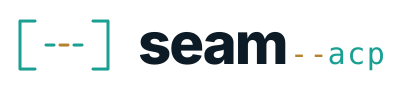

# seam-acp

<picture>
  <source media="(prefers-color-scheme: dark)" srcset="assets/seam-acp-logo-dark.svg">
  
</picture>

A bridge between chat platforms (Discord today, Slack tomorrow) and ACP-compatible coding agents (GitHub Copilot today, Claude Code / others tomorrow).

> **Status:** v0 — Discord + GitHub Copilot is the proven path. A Gemini ACP profile ships in the box; the multi-platform / multi-agent abstractions are designed in from day one.

> **Using Seam as an agent?** Start with the lean
> [Seam agent primer and guide index](docs/agent-guides/README.md). This README
> is for installing and operating the bridge.

## What it does

- Run a chat bot on a server / home lab / VM.
- From your phone (Discord), spin up a session per thread.
- Pick a repo with interactive buttons; chat with a coding agent in the thread.
- Switch model on the fly (interactive picker). Switch mode (Agent / Plan / Autopilot). Switch agent.

## Why ACP

The [Agent Client Protocol](https://agentclientprotocol.com) is the LSP-equivalent for coding agents. Picking ACP means:

- The agent integration is a typed protocol, not a vendor SDK.
- Switching to a different ACP-compatible agent is a config change, not a rewrite.
- We get streaming updates, mode switching, and live model switching as first-class features.

## Configure

Copy `.env.example` to `.env` and fill it in.

| Variable | Required | Notes |
|---|---|---|
| `DISCORD_BOT_TOKEN` | yes | From the Discord developer portal |
| `DISCORD_ALLOWED_USER_IDS` | yes | Comma-separated Discord user IDs that can control the bot (e.g. `123,456`) |
| `DISCORD_ALLOWED_CHANNEL_IDS` | no | Comma-separated parent channel IDs the bot is allowed to operate in. When set, the bot only responds in threads whose parent channel is in this list. When unset, all channels are allowed. |
| `DISCORD_DEV_GUILD_ID` | no | Set to register slash commands instantly to one guild (good for dev) |
| `REPOS_ROOT` | yes | Root folder containing repos the agent can touch |
| `ATTACH_ROOTS` | no | Comma-separated extra absolute directories the `/seam attach` command (and the agent-side fence-to-file shortcut) can read from. `REPOS_ROOT` is always allowed. |
| `DATA_DIR` | no | Defaults to `./data` (sqlite lives here) |
| `DEFAULT_AGENT` | no | `copilot` (default), `agy`, or `claude`. Plus any `copilot-<id>` / `agy-<id>` / `claude-<id>` registered via the `*_PROFILES` vars. |
| `DEFAULT_MODEL` | no | Default Copilot model. Applies to **all** Copilot profiles (including extras from `COPILOT_PROFILES`). e.g. `gpt-5.4`, `claude-sonnet-4.5`, `claude-opus-4.7`, `auto` |
| `COPILOT_CLI_PATH` | no | If `copilot` is not on `PATH` |
| `AA_API_KEY` | no | Artificial Analysis Data API key. Required for the 12-hour Copilot model-value snapshot refresh; the prior snapshot remains available when absent. |
| `MODEL_VALUE_STD_INPUT_TOKENS` | no | Fixed input-token count for model-value cost comparisons. Default `8000`. |
| `MODEL_VALUE_STD_OUTPUT_TOKENS` | no | Fixed output-token count for model-value cost comparisons. Default `2000`. |
| `COPILOT_PROFILES` | no | Register additional Copilot profiles, each with its own auth / config dir. Format: `id1:/abs/dir1,id2:/abs/dir2`. Each becomes an agent profile named `copilot-<id>` in `/seam config agent`. Lets one bot serve multiple GitHub accounts; see "Multiple Copilot accounts" below. |
| `AGY_ENABLED` | no | Enables the package-backed public `agy` profile only when its exact wrapper/runtime configuration and permission-risk acknowledgement are also present. Default `false`. |
| `AGY_ACP_BIN` / `AGY_ACP_SHA256` | with AGY | Exact compiled `antigravity-acp` v1.1.0 asset and reviewed platform digest. Seam never downloads it. |
| `AGY_BIN` / `AGY_VERSION` / `AGY_SHA256` | with AGY | Exact host-local authenticated `agy` executable, expected `--version` output, and digest used for catalog evidence and runtime. |
| `CLAUDE_CLI_PATH` | no | If `claude-agent-acp` is not on `PATH` |
| `CLAUDE_DEFAULT_MODEL` | no | Default Claude model — applied even when `DEFAULT_AGENT` is `copilot`. Default `claude-sonnet-4.5`. |
| `CLAUDE_PROFILES` | no | Same shape as `COPILOT_PROFILES`. Each entry registers a `claude-<id>` profile pinned to its own `CLAUDE_CONFIG_DIR`. See "Multiple Claude accounts" below. |
| `TURN_TIMEOUT_SECONDS` | no | Default 900 |
| `RESTART_DRAIN_TIMEOUT_MS` | no | Maximum graceful redeploy drain before force restart. Default 900000 (15 minutes). Discord stays answerable throughout — only new dispatches, parked fires and preset openers are held. |
| `SHUTDOWN_QUIESCE_TIMEOUT_MS` | no | Per-stage ceiling on the SIGTERM quiesce — how long each shutdown drain waits for in-flight work while the adapter and store are still open. Default 10000. The whole shutdown also draws from a fixed 20s budget, so larger values are capped by it. Work left outstanding is repaired at the next boot. |
| `LOG_LEVEL` | no | `fatal` / `error` / `warn` / `info` / `debug` / `trace` |
| `HEALTH_PORT` | no | Default 3000 — exposes `GET /health` |
| `DEFAULT_PERMISSION_POLICY` | no | `ask` (recommended). Bot-wide default policy for new sessions. One of `always` (auto-approve), `ask` (prompt me on Discord), `deny` (auto-deny). Override per-session with `/seam config approve`. |
| `DEFAULT_AUTO_APPROVE` | no | *Deprecated.* When `true`, forces the bot-wide default to `always`. Prefer `DEFAULT_PERMISSION_POLICY`. |

You also need the GitHub Copilot CLI installed locally (`brew install github/gh/copilot` or `npm i -g @github/copilot`) and authenticated (`copilot auth login`). The Docker image installs and runs the CLI for you, but you still need to mount auth state or sign in inside the container.

To use the **Anthropic Claude** profile, install the ACP adapter (and the underlying CLI for auth):

```sh
npm i -g @anthropic-ai/claude-code @agentclientprotocol/claude-agent-acp
claude /login
```

The **Google Antigravity (`agy`)** profile uses the pinned compiled
`antigravity-acp` wrapper and an exact host-local `agy` binary. It is deliberately
disabled until its artifact digest, directories, semantic credential scope, and
permission-bypass acknowledgement are configured. Seam forces
`AGY_SKIP_DOWNLOAD=1`; neither startup nor catalog refresh downloads or replaces
either executable. Authentication is a separate operator action performed on
the runtime host, never by Seam. Read the security and account-risk requirements
in [the AGY integration runbook](docs/agy-package-integration.md) before enabling it.

## Run (local dev)

```sh
npm install
cp .env.example .env   # then edit
npm run dev
```

The bot starts, registers `/seam` slash commands (guild-scoped if `DISCORD_DEV_GUILD_ID` is set, global otherwise — global takes up to an hour to propagate), and exposes `GET /health` on `HEALTH_PORT`.

## Run (Docker)

```sh
docker compose up -d --build
```

Pass `--build-arg INSTALL_COPILOT_CLI=false` if you want to mount your own Copilot CLI binary.

## Run (systemd — production, no Docker)

Production runs Seam as a native systemd service so it has an independent
cgroup, restart policy, and OOM boundary. The shared Pronoa Playwright MCP runs
in a second native service with separate memory controls and lower CPU/I/O
priority. PM2 remains only for helper processes and uses `OOMPolicy=continue`.
The checked-in unit templates and rollback procedure are documented in
[`ops/systemd/README.md`](ops/systemd/README.md).

**After making code changes**, use the dedicated redeploy script instead of
restarting the unit directly. It builds, writes a restart sentinel, lets the
running bot drain admitted work, signals Seam with SIGTERM, and lets systemd
restart it:

```sh
npm run redeploy
```

Other useful commands:

```sh
systemctl status seam-acp --no-pager
journalctl -u seam-acp -f
curl -fsS http://127.0.0.1:3000/health
systemctl status pronoa-playwright-mcp --no-pager
```

## Slash commands

The tree is split across **two** application commands (#151). Discord caps a
single command at 8,000 characters — the sum of every name, description and
choice value — and rejects registration of the *whole* command at boot when it
is exceeded. `/seam` had 15 characters of headroom, so the operator half moved
to its own command and its own fresh 8,000.

- **`/seam`** — everyday user + agent surface. 8 slots: `cancel` `steer` `new`
  `workflows` `queue`, plus the `config` (18), `info` (6) and `preset` (7) groups.
- **`/seamadmin`** — operator surface. Top-level `rebuild`, `compact-thread`,
  and `recover`, plus the `schedule` (5), `project` (3), `upload` (3),
  `bridge` (4), `debug` (6), `voice` (7), `catalog` (1), and `naming` (2) groups. Registered with `default_member_permissions =
  ManageGuild` and `contexts = [Guild]`, so it does not appear in the command
  picker for non-admins and is unavailable in DMs.

That permission is a **visibility** control, not the authorization model: every
runtime refusal (`SEAM_CONFIG_ADMIN_USER_IDS`, the bridge/voice admin gates,
the `naming rename` gate) is still enforced in the handler, because a guild
admin can grant `/seamadmin` to anyone.

Discord has no command aliasing, so this was a **hard cutover** — `/seam debug …`
simply ceases to exist once the new set is registered. Moved paths:
`/seam rebuild|schedule|project|upload|bridge|debug|voice` → `/seamadmin …`, and
`/seam config rename|namer` → `/seamadmin naming rename|namer`.

All commands are restricted to users listed in `DISCORD_ALLOWED_USER_IDS` and (where it matters) thread-scoped.

| Command | What it does |
|---|---|
| `/seam new [name]` | Create a new public thread, add you to it, bind a session, and post the `/seam config edit` card — all in one step |
| `/seam cancel` | Gracefully cancel this thread's in-flight turn |
| `/seam cancel force:true` | Escalate: cancel, then force-kill this thread's turn if it's hung (old `/seam abort`) |
| `/seam cancel scope:all` | Force-kill every active session bot-wide (old `/seam kill`). Privileged — not lock-exempt, not participant-allowed. |
| `/seam steer <thread> <prompt> [now]` | Steer a node mid-task (inbox by default; `now:true` cancel-and-reprompt) |
| `/seam attach <path>` | Upload a host-side file (under `REPOS_ROOT` or `ATTACH_ROOTS`) into the channel without involving the agent |
| `/seam workflows` | Delegation ledger + this thread's pending wakes/watches |
| `/seam config init` | Bind the current thread as a session and post the `/seam config edit` card (same surface as `/seam new`) |
| `/seam config repo <path>` | Set the working repo (relative to `REPOS_ROOT` or absolute under it) |
| `/seam config agent [id]` | With no id: posts an interactive picker of registered profiles. With id: switch directly. |
| `/seam config model [id]` | Uses the host-scoped cached operational catalog; with no id, posts a picker without starting an agent. A model change atomically pins that model's catalog default effort and applies via the adapter's live/reload/fresh-session mode. |
| `/seam config mode <id>` | Set the agent operational mode (e.g. plan / agent / autopilot) |
| `/seam config effort <low\|medium\|high>` | Set reasoning effort (model-dependent) |
| `/seam config tools <allow\|exclude> [csv]` | Tool allow / exclude list (empty list = clear) |
| `/seam config approve <always\|ask\|deny>` | Permission policy for this thread. `always` auto-approves every request; `ask` posts a Discord prompt with buttons (auto-denies after 5 min); `deny` auto-denies. |
| `/seam config reset` | End the current ACP session for this thread; next message starts a fresh one |
| `/seam config edit` | Draft-then-save config card: agent (`agentId@host`), model, effort, repo, role, rider, approve, card/GIF. One **Agent** control sets the host — there is no separate host selector. |
| `/seam config show` | Show the session config JSON |
| `/seam config set [json] [agent] [model] [effort] [repo] [role] [permissions] [card] [gif] [rebuild]` | Patch supplied session fields together, with autocomplete, or use `json` alone to replace the session config wholesale. Optional `rebuild:true` rebuilds the session from Discord after a successful set. |
| `/seam config audit` | Recent config mutations (who/what/when) |
| `/seam info repos` | List repos found under `REPOS_ROOT` (hidden directories are skipped) |
| `/seam info sessions` | List recent sessions across the bot |
| `/seam info whoami` | Show which account this thread's agent profile is signed in as (Copilot only — reads `<config-dir>/config.json`) |
| `/seam info avatar` | Re-push the bot avatar to Discord (force re-upload) |
| `/seam info help` | Show this list |
| `/seam preset` | Reusable session presets (`list` `create` `apply` `delete` `show` `edit` `thread`) |
| `/seamadmin rebuild` | Deterministic Discord reconstruction (no summarizer; one destination seed turn, up to 60% of the destination context window) |
| `/seamadmin compact-thread [agent] [model]` | Model-assisted reconstruction from Discord history (the former Rebuild) |
| `/seamadmin naming rename [scope] [migrate-legacy] [role-name]` | Rebuild thread names from their identity. Admin-gated in the handler (#160) |
| `/seamadmin naming namer` | Edit the agent / model / role symbol tables |
| `/seamadmin schedule` | Recurring scheduled prompts (`add` `list` `remove` `toggle` `edit`) — **no attachments** since #158 |
| `/seamadmin project` | DB-backed channel activation (`new` `list` `remove`), no redeploy |
| `/seamadmin upload` | Host file transfer (`pull` `push` `secret`) |
| `/seamadmin bridge` | Pair remote bridges (`add` `rotate` `list` `remove`) |
| `/seamadmin debug` | Host debug (`tail` `exec` `status`) and the live-help voice spike |
| `/seamadmin voice` | Shared Voice Console V2 (`start` `add` `remove` `configure` `console` `status` `stop`) |
| `/seamadmin catalog refresh <agent@location\|all>` | Force an operational catalog refresh and report generation, diff, scope, provenance, and retained/quarantined failures. |

Session history recovery (four distinct operations):

- `/seam config reset` — blank ACP session, no history loaded.
- **Rebuild** (`/seamadmin rebuild` or the sessions-card Rebuild button) — deterministic Discord reconstruction. No summarizer/model calls except the one destination seed turn. The seed can use up to 60% of the destination model's context window.
- **Compact from Thread** (`/seamadmin compact-thread` or the sessions-card Compact from Thread button) — the former Rebuild: Discord history summarized by a model, then seeded.
- **Premium Compact (Discord)** — multi-stage AGY analysis, then a destination seed.

Interactive pickers use buttons for ≤15 choices (laid out across up to 3 rows of 5) and a select menu for 16–25.

Free-form messages in a thread are sent straight to the agent. You can attach
files to a message and they'll be forwarded as ACP content blocks: images and
text-ish files (markdown, source code, JSON, CSV, logs, etc.) are inlined when
the agent supports it; everything else is sent as a CDN link the agent can
fetch. Limits per message: 8 attachments, 5 MB each, text inlined up to 256 KB.

If the agent emits an image, audio file, or embedded resource (in a tool
result or its own message stream), the bot uploads it to the thread as a
Discord attachment. Discord's free-tier 25 MB upload limit applies.

The bot also auto-uploads two adjacent cases:

- **Streaming fence-to-file.** Every fenced code block the agent emits is
  captured as it streams, stripped from chat, and uploaded as a Discord
  attachment named `snippet-N.<ext>` (extension inferred from the language
  tag; unknown tags fall back to `.txt`). This keeps long code out of the
  chat, makes the empty-pill / unclosed-fence runaway bug architecturally
  impossible, and gives consistent UX for any size snippet.
- **Fence-as-file shortcut.** If a fence's entire content is a single line
  that resolves to a real file under `REPOS_ROOT` or `ATTACH_ROOTS`, the
  bot uploads the *referenced file* instead of the snippet text. Symlinks
  are followed and the realpath is re-validated. Useful for "give me back
  that doc as an attachment" prompts.

### Multiple Copilot accounts

You can register more than one Copilot profile, each authenticated as a
different GitHub account, by setting `COPILOT_PROFILES`:

```sh
COPILOT_PROFILES=work:/Users/me/.copilot-work,personal:/Users/me/.copilot-personal
```

For each entry the bot spawns `copilot --acp --config-dir <dir>`. Copilot
keeps **all** of its state per `--config-dir` — auth tokens, MCP config,
session history — so the two profiles are fully isolated CLIs sharing
one binary. They show up in `/seam config agent` as `copilot-work` and
`copilot-personal` alongside the default `copilot` profile.

One-time setup per account on the host (or inside the container):

```sh
COPILOT_HOME=/Users/me/.copilot-work copilot login
COPILOT_HOME=/Users/me/.copilot-personal copilot login
```

Verify in a thread with `/seam info whoami` — the bot reads
`<config-dir>/config.json` and reports the GitHub login.

### Antigravity account scope

> **Note:** agy (Antigravity CLI) is Google's official replacement for the deprecated Gemini CLI. The Gemini CLI service was sunset on June 18, 2026.

Each `agy@location` binding uses that host's own `HOME`, wrapper state at
`~/.agy-acp`, exact conversation directory, and a non-secret semantic scope
label. Seam does not copy credentials between hosts or accept an account email
as the scope. Multiple accounts on one host require separately isolated bridge
services/HOMEs; automatic profile multiplexing is intentionally not provided.

### Multiple Claude accounts

Same pattern as Copilot, using `CLAUDE_PROFILES`:

```sh
CLAUDE_PROFILES=work:/Users/me/.claude-work,personal:/Users/me/.claude-personal
```

For each entry the bot spawns `claude-agent-acp` with
`CLAUDE_CONFIG_DIR=<dir>` in the child env. Each dir holds its own
auth and settings. Profiles show up in `/seam config agent` as `claude-work`
and `claude-personal` alongside the default `claude` profile.

One-time setup per account on the host:

```sh
CLAUDE_CONFIG_DIR=/Users/me/.claude-work claude /login
CLAUDE_CONFIG_DIR=/Users/me/.claude-personal claude /login
```

`/seam info whoami` is best-effort for Claude — it tries to read the email /
account from `<config-dir>/.credentials.json` (and a couple of fallbacks).
If that fails (file format changes upstream, etc.) the command still
reports which profile id you're on.

#### ⚠️ Claude model verification

Older `claude-agent-acp` releases resolved some aliases and full IDs to the
wrong model or context window. The current integration avoids that historical
surface by exposing only verified, native-context canonical IDs.

Because of this:

- The `CLAUDE_MODELS` picker in `.env` contains only **empirically verified**
  entries (each one checked against JSONL ground truth, not the model's
  self-report). It contains only native-1M models and does not expose context
  variants. Don't add a model without verifying it.
- On the current `claude-agent-acp` 0.73.0 / ACP SDK 1.4.0 stack, no local patch is needed:
  model selection goes through `setSessionConfigOption`, which exact-matches full
  canonical `claude-*` IDs against the advertised list before the fuzzy resolver.
  Native context windows are declared in `packages/adapters/src/profiles/claude.ts`
  (`CLAUDE_CONTEXT_WINDOWS`) — no `[1m]` suffix.
- The status card shows the **resolved** API model id and the current reasoning
  effort on every turn, so a wrong-model regression is visible immediately.

**Anyone updating `claude-agent-acp` / `@anthropic-ai/claude-code`, changing the
model picker, or touching effort handling must follow
[`docs/model-management-runbook.md`](docs/model-management-runbook.md)** — the
authoritative, step-by-step empirical process (pull versions → read changelogs →
update → verify the pristine install → verify against JSONL → confirm new/resumed sessions).

### Remote agents

Remote agents are being rebuilt as location bindings — see [`docs/seam-bridge-plan.md`](docs/seam-bridge-plan.md).
Use the dry-run-first [`remote bridge rollout runbook`](docs/bridge-rollout.md)
for PM2 bridge updates; it stages versioned artifacts without remote Git and
requires an explicit one-host apply for activation or rollback.

### MCP servers

The bot can attach Model Context Protocol servers globally to every
session. Configure them via env vars:

| Env var | Server | What it adds |
|---|---|---|
| `MCP_PLAYWRIGHT_ENABLED=true` | [`@playwright/mcp`](https://www.npmjs.com/package/@playwright/mcp) | Real Chromium browser. Lets the agent navigate sites and take screenshots; screenshots flow back as Discord attachments via the agent-file pipeline. Chromium (~150 MB) is downloaded by Playwright on first run. |

Add new servers in `src/mcp.ts`. Anything that emits `image` / `audio` /
embedded resource content blocks will be picked up automatically and
uploaded to the thread.

## Architecture

```
ChatAdapter          (Discord today, Slack tomorrow)
   ↓
Orchestrator   ──→   Renderer  (platform-specific text formatting)
   ↓
SessionRouter  ──→   SessionStore  (sqlite via better-sqlite3)
   ↓
AgentRuntime         (one per session; auto-resumes on restart)
   ↓
AgentProfile         (Copilot today, Claude Code tomorrow — adds via `src/agents/profiles/`)
```

- **`src/platforms/chat-adapter.ts`** — generic chat platform interface.
- **`src/platforms/discord/`** — discord.js v14 implementation + slash commands + repo picker.
- **`src/agents/agent-runtime.ts`** — wraps `@agentclientprotocol/sdk` + a child process running an ACP server. Handles `initialize`, `session/new`, `session/load`, `session/prompt`, `session/cancel`, model / mode / config option setters, and emits typed events.
- **`packages/adapters/src/profiles/copilot.ts`** — spawns `copilot --acp`. Sibling profiles include `agy.ts` (pinned package-backed Antigravity ACP), `agy-old.ts` (disabled rollback only), `claude.ts`, `codex.ts`, and `grok.ts`.
- **`src/core/`** — pure utilities: text chunker, path safety, sqlite store, session router, status panel.

## Testing

```sh
npm test         # unit tests + 1 integration test against `copilot --acp`
npm run typecheck
npm run build
```

The ACP integration test is automatically skipped if `copilot` is not on `PATH`.

## License

MIT — see [LICENSE](LICENSE).
